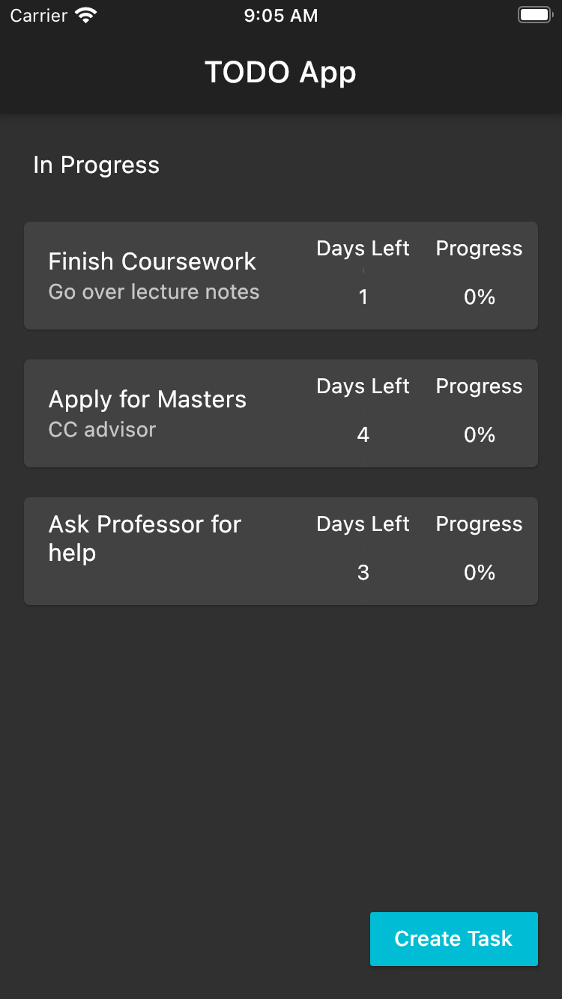
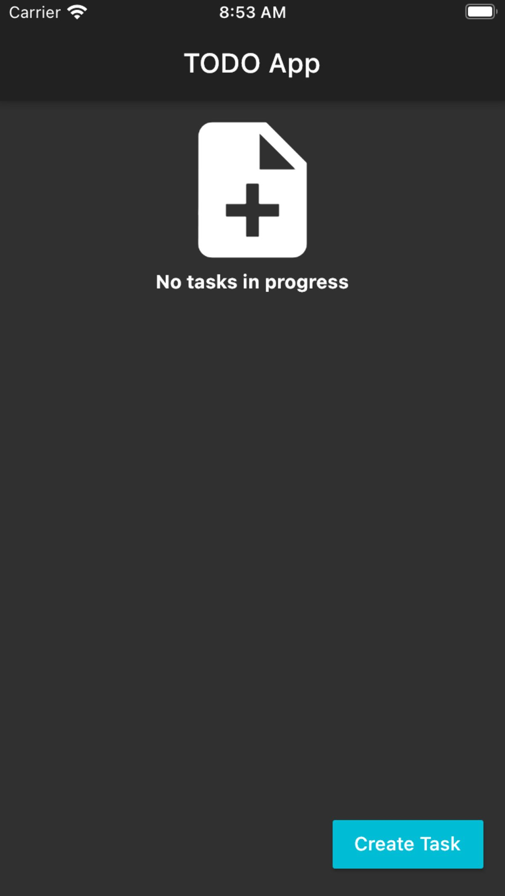
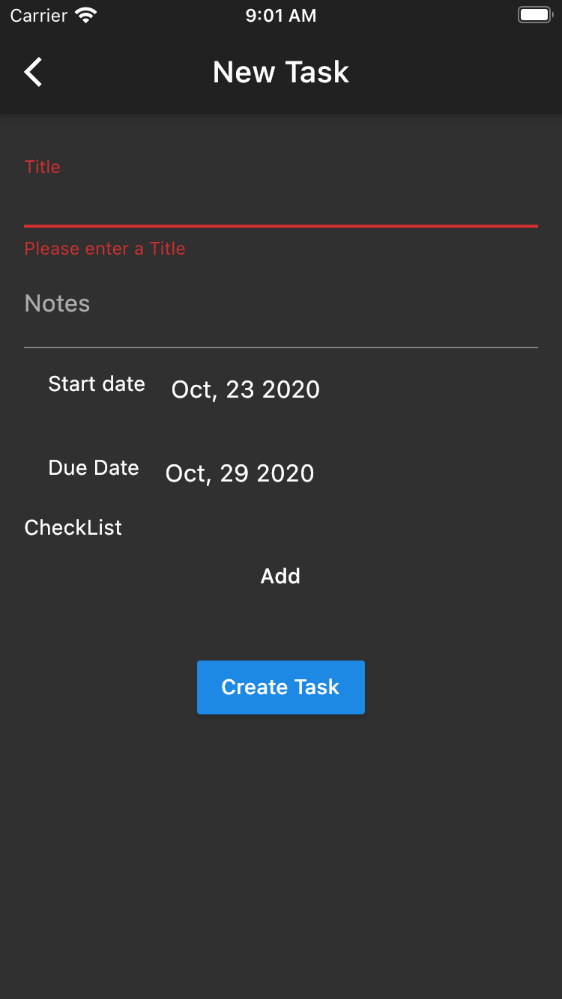
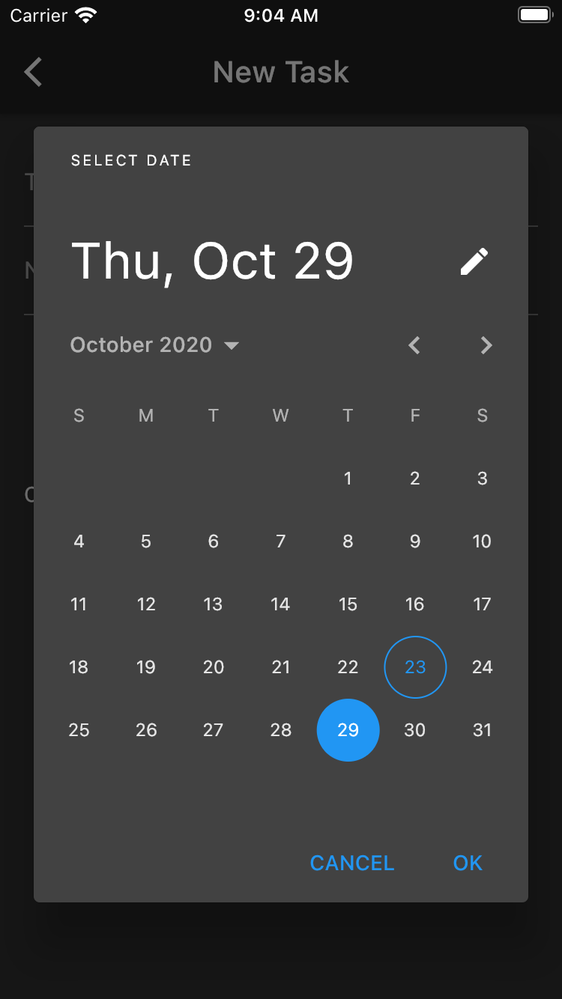
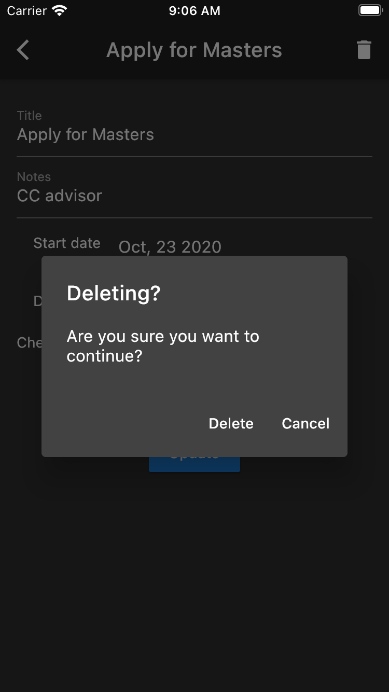

# TODO_Flutter_Application

## Installation process to run Task manager app

[Installation Process](https://flutter.dev/docs/get-started/install).
Be sure to run flutter doctor command to make sure everything is in order

## Pick favourite editor within flutter directory and run app

Install/Update dev tools to latest version
Run command on command line within flutter/app directory - flutter run

## TODO Flutter application snapshots

